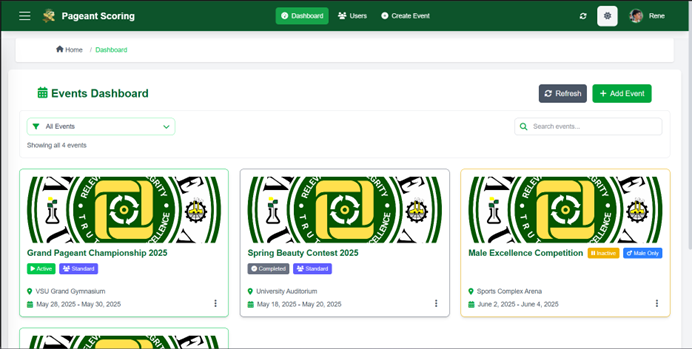

# Web-Based Pageant Scoring System (Frontend)

  

> **The frontend user interface for the digital tabulation system used at Visayas State University.**

This repository contains the client-side code for the Pageant Scoring System. It provides the interactive interfaces used by administrators, judges, and tabulators to visualize data and input scores during live events.

**Architecture Note:**
This repository houses the **Frontend** only. The backend API (handling database logic, authentication, and calculations) is located in a separate, **private repository**.

Consequently, this frontend cannot be fully executed locally without access to the running backend server. **If you are a recruiter or developer and wish to review the backend code or request a full system demo, please [contact me](#developed-by) directly.**

  

---

## Frontend Features

* **Role-Based Views:** Dynamic routing and layouts that render different interfaces based on user roles (Admin, Judge, Tabulator).
* **Real-Time State Management:** Utilizes **Pinia** and **Pusher** to update the UI instantly when scores are submitted from other devices.
* **Responsive Layouts:**
    * **Judge View:** Touch-optimized mobile interface for easy scoring on tablets/phones.
    * **Tabulator View:** Data-dense desktop tables for monitoring rankings.
* **Report Generation:** Client-side rendering of PDF previews for final results.

---

## Tech Stack

* **Framework:** Vue 3 (Composition API)
* **Styling:** Tailwind CSS
* **State Management:** Pinia
* **Networking:** Axios (HTTP) & Laravel Echo (WebSockets)
* **Build Tool:** Vite

---

## Developed By

**Rene Angelo de los Reyes**

 
